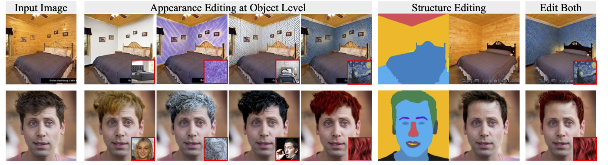

# PAIR Diffusion: A Comprehensive Multimodal Object-Level Image Editor
[[`Project Page`](https://vidit98.github.io/publication/conference-paper/pair_diff.html)] [[`arXiv`](https://arxiv.org/abs/2303.17546)] [[`pdf`](https://arxiv.org/pdf/2303.17546.pdf)] [[`BibTeX`](#BibTex)]

[](https://pytorch.org/) [](https://huggingface.co/spaces/PAIR/PAIR-Diffusion) [](https://youtu.be/_Zr1pOi7Chw) [](https://opensource.org/licenses/MIT)


<a href="https://vidit98.github.io/" style="color:blue;">Vidit Goel</a><sup>1</sup>, 
  <a href="https://helia95.github.io/" style="color:blue;">Elia Peruzzo</a><sup>1,2</sup>,
  <a href="https://yifanjiang19.github.io/" style="color:blue;">Yifan Jiang</a><sup>3</sup>, 
  <a href="https://ifp-uiuc.github.io/" style="color:blue;">Xingqian Xu</a><sup>3</sup>, 
  <a href="https://ir1d.github.io/" style="color:blue;">Dejia Xu</a><sup>3</sup>, 
  <a href="http://disi.unitn.it/~sebe/" style="color:blue;">Nicu Sebe</a><sup>2</sup>,
  <a href=" https://people.eecs.berkeley.edu/~trevor/" style="color:blue;">Trevor Darrell</a><sup>4</sup>, 
  <a href="https://vita-group.github.io/" style="color:blue;">Zhangyang Wang</a><sup>1,3</sup>
  and <a href="https://www.humphreyshi.com/home" style="color:blue;">Humphrey Shi</a> <sup>1,5,6</sup> <br>

  

  

## Features
All the operations below can be performed at an object level. Our framework is general and can be applied to any diffusion model.
1. Appearance Editing
2. Free Form Shape Editing
3. Adding Objects
4. Variation
5. Multimodal control using reference images and text
## News
 * [30/12/2023] Models and code released.  
 * [10/11/2023] New and improved method and models 🚀🚀. Models and code will be released soon.
 * [04/09/2023] Inference code released
 * [04/07/2023] Demo relased on [🤗Huggingface space](https://huggingface.co/spaces/PAIR/PAIR-Diffusion)!
 * [03/30/2023] Paper released on [arXiv](https://arxiv.org/abs/2303.17546)


## Results
Given below are results for appearace editing using our method on SDv1.5


## Object Level Image Editing
### Appearance Editing

<p align="center">
  
</p>

### Free form Shape Editing and Adding Object

<p align="center">
  
</p>


For more results please refer to our project page and paper. 

## Requirements
Setup the conda environment using the command below. We use Oneformer to get segmentation maps during inference, please setup environment for Oneformer following [the repo](https://github.com/SHI-Labs/OneFormer/blob/main/INSTALL.md)
```
conda env create -f environment.yml
conda activate pair-diff
```

## Inference
To run the model launch the gradio demo using the command below. It will download the required models as well.

```
python gradio_demo.py
```

## Pretrained Models

We applied PAIR Diffusion on SDv1.5 and uses COCO-Stuff dataset for finetuning the model. The model card can be downloaded from [here](https://huggingface.co/PAIR/PAIR-diffusion-sdv15-coco-finetune)


## BibTeX
If you use our work in your research, please cite our publication:
```
@article{goel2023pair,
      title={PAIR-Diffusion: Object-Level Image Editing with Structure-and-Appearance Paired Diffusion Models},
      author={Goel, Vidit and Peruzzo, Elia and Jiang, Yifan and Xu, Dejia and Sebe, Nicu and Darrell, Trevor and 
      Wang, Zhangyang and Shi, Humphrey},
      journal={arXiv preprint arXiv:2303.17546},
      year={2023} 
      }
```
