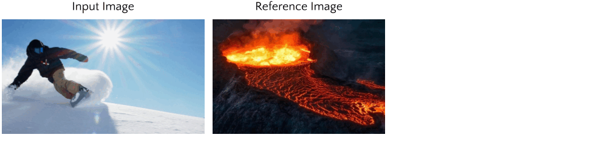
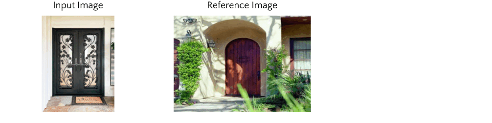
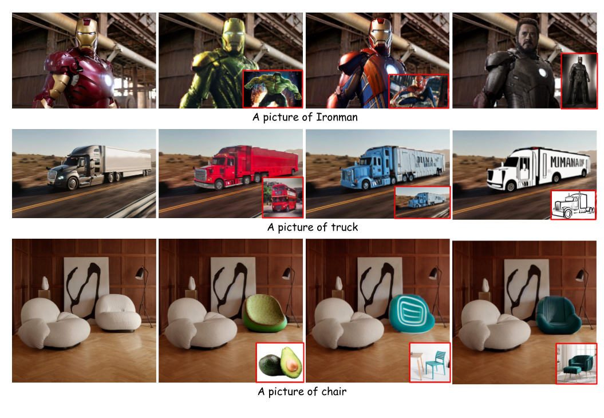
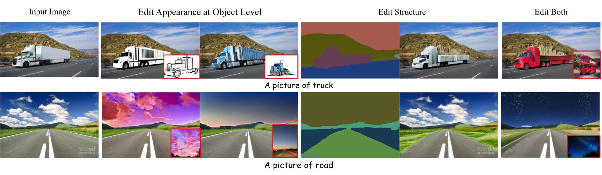
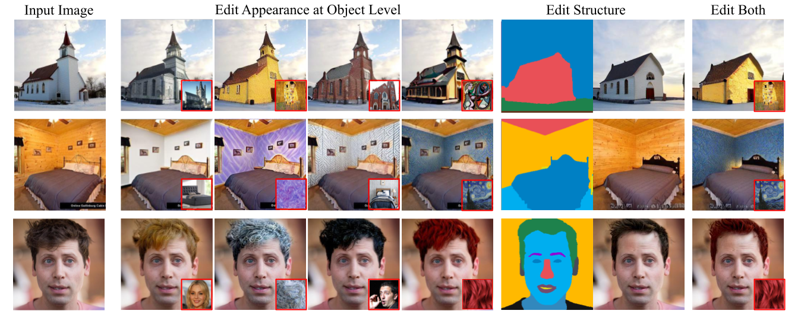

# PAIR-Diffusion
This is the official repo for the work:

**PAIR-Diffusion: Object-Level Image Editing with
Structure-and-Appearance Paired Diffusion Models**<br>
<a href="https://vidit98.github.io/" style="color:blue;">Vidit Goel</a><sup>1*</sup>, 
  <a href="https://helia95.github.io/" style="color:blue;">Elia Peruzzo</a><sup>1,2*</sup>,
  <a href="https://yifanjiang19.github.io/" style="color:blue;">Yifan Jiang</a><sup>3</sup>, 
  <a href="https://ir1d.github.io/" style="color:blue;">Dejia Xu</a><sup>3</sup>, 
  <a href="http://disi.unitn.it/~sebe/" style="color:blue;">Nicu Sebe</a><sup>2</sup>,
  <a href=" https://people.eecs.berkeley.edu/~trevor/" style="color:blue;">Trevor Darrell</a><sup>4</sup>, 
  <a href="https://vita-group.github.io/" style="color:blue;">Zhangyang Wang</a><sup>1,3</sup>
  and <a href="https://www.humphreyshi.com/home" style="color:blue;">Humphrey Shi</a> <sup>1,5,6</sup> <br>

In association with Picsart AI Research (PAIR)<sup>1</sup>, UTrento<sup>2</sup>, UT Austin<sup>3</sup>, UC Berkeley<sup>4</sup>, UOregon<sup>5</sup>, UIUC<sup>6</sup>

*equal contribution

We built Structure and Appearance Paired (PAIR) Diffusion that allows reference image-guided appearance manipulation and structure editing of an image at an object level. Describing object appearances using text can be challenging and ambiguous, PAIR Diffusion enables a user to control the appearance of an object using images.

Try our demo at [](https://huggingface.co/spaces/PAIR/PAIR-Diffusion)


[[arXiv](https://arxiv.org/abs/2303.17546)][[Video](https://drive.google.com/file/d/1s96TNWgAwBjRDTyFTWakZosO3Ot_Fny6/view?usp=share_link)]

## News
 * [04/09/2023] Inference code released
 * [04/07/2023] Demo relased on [🤗Huggingface space](https://huggingface.co/spaces/PAIR/PAIR-Diffusion)!
 * [03/30/2023] Paper released on [arXiv](https://arxiv.org/abs/2303.17546)


## Results
Given below are results for appearace editing using our method on SDv1.5




## Object Level Image Editing
### Stable Diffusion Results
* Applying our method to Stable Diffusion allows reference image based editing in the wild

<p align="center">
  
</p>

* We can edit both structure and appearance of the objects independently.

<p align="center">
  
</p>


### Unconditional Diffusion Models
* PAIR diffusion also works with unconditional diffusion models, we show results on LSUN churches, bedrooms and CelebA-HQ. We can perform edits using both in-domain and out-of-domain reference images.
<p align="center">
  
</p>

## Requirements
Setup the conda environment using the command below. We use Oneformer to get segmentation maps during inference, please setup environment for Oneformer following [the repo](https://github.com/SHI-Labs/OneFormer/blob/main/INSTALL.md)
```
conda env create -f environment.yml
conda activate pair-diff
```

## Inference
To run the model launch the gradio demo using the command below. It will download the required models as well.

```
python gradio_app.py
```

## Pretrained Models

We applied PAIR Diffusion on SDv1.5 and uses COCO-Stuff dataset for finetuning the model. The model card can be downloaded from [here](https://huggingface.co/PAIR/PAIR-diffusion-sdv15-coco-finetune)


## BibTeX
If you use our work in your research, please cite our publication:
```
@article{goel2023pair,
      title={PAIR-Diffusion: Object-Level Image Editing with Structure-and-Appearance Paired Diffusion Models},
      author={Goel, Vidit and Peruzzo, Elia and Jiang, Yifan and Xu, Dejia and Sebe, Nicu and Darrell, Trevor and 
      Wang, Zhangyang and Shi, Humphrey},
      journal={arXiv preprint arXiv:2303.17546},
      year={2023} 
      }
```
